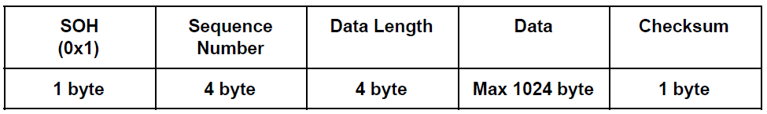

# :school: Tugas Besar Jaringan Komputer :school:  <!-- omit in toc -->

# To Do List <!-- omit in toc -->
- [ ] Penentuan besar Timeout
- [ ] Penerapam Pumba
- [ ] Penjelasan Fungsi

# :maple_leaf: Table of Content  <!-- omit in toc -->
- [:busts_in_silhouette: Nama Anggota Kelompok](#busts_in_silhouette-nama-anggota-kelompok)
- [:speech_balloon: Deskripsi Tugas](#speech_balloon-deskripsi-tugas)
- [:computer: Penjelasan Program](#computer-penjelasan-program)
	- [Compiling Program](#compiling-program)
	- [Penggunaan Program](#penggunaan-program)
- [:scroll: Penjelasan Sliding Window](#scroll-penjelasan-sliding-window)
	- [Selective Repeat ARQ](#selective-repeat-arq)
	- [Protokol dalam Program](#protokol-dalam-program)
- [:mag_right: Penjelasan Fungsi-Fungsi](#mag_right-penjelasan-fungsi-fungsi)
	- [config](#config)
	- [recvfile](#recvfile)
	- [sendfile](#sendfile)
- [:hourglass: Pembagian Tugas](#hourglass-pembagian-tugas)
- [:bookmark: About](#bookmark-about)

## :busts_in_silhouette: Nama Anggota Kelompok
:point_right: **Seperayo** -  **13516068**

:point_right: **Hafizh Budiman** - **13516137**

:point_right: **Ilham Firdausi Putra** - **13516140**

## :speech_balloon: Deskripsi Tugas
Program yang akan dibuat terdiri dari dua file , yaitu sender dan receiver . Implementasi diwajibkan menggunakan bahasa C/C++ dengan protokol UDP. Program sender akan membaca suatu file dan mengirimnya ke receiver dengan menggunakan Sliding Window Protocol . Program receiver akan menerima data yang dikirim dan menuliskan file tersebut ke file system .

## :computer: Penjelasan Program
### Compiling Program
Pragram dapat di compile dengan menggunakan perintah **`make`** pada command line. :ledger: Gunakan ***Linux*** demi kompatibilitas library yang lebih baik :ledger:

```
all: recvfile sendfile

recvfile: src/config.h src/config.cpp src/recvfile.cpp
	g++ -pthread src/config.cpp src/recvfile.cpp -o recvfile -std=c++11 

sendfile: src/config.h src/config.cpp src/sendfile.cpp
	g++ -pthread src/config.cpp src/sendfile.cpp -o sendfile -std=c++11 

clean: recvfile sendfile
	rm -f src/recvfile src/sendfile
```

### Penggunaan Program
1. Setelah berhasil dicompile gunakan command berikut untuk memulai pengiriman file
```
   ./sendfile <filename> <windowsize> <buffersize> <destinationIP> <destinationPort>
```
2. Command berikut digunakan untuk menerima file
```
   ./recvfile <filename> <windowsize> <buffersize> <port>
```
3. Program akan secara otomatis mengirimkan data file dan menuliskan proses pengirimannya di command prompt
4. Hal yang perlu diperhatikan
   * File yang dikirim harus ada di folder yang sama
   * Nama file dapat diubah saat menggunakan command di poin 2

## :scroll: Penjelasan Sliding Window
### Selective Repeat ARQ
Program kami menerapkan **Sliding Window Protocol: Selective Repeat ARQ *(Automatic Repeat Request)***. Protokol ini berbeda dengan ***Go Back N***, dimana protokol ***Go Back N*** memerlukan proses pengiriman untuk mengirimkan seluruh packet dari yang gagal hingga terakhir di kirim. Protokol ***Selective Repeat*** hanya akan mengirimkan packet yang lost saja tanpa melakukan ***discard*** terhadap packet setelahnya. Selain itu, Protokol *Selective Repeat* memiliki performa yang lebih tinggi dibanding *Go Back N* jika data yang ditransmit memiliki banyak error, dimana *Go Back N* akan menghabiskan banyak bandwitdth saat melakukan ***discard & retransmission***. Perbedaan besar window juga mempengaruhi performa kedua protokol, **Selective Repeat** lebih ideal digunakan untuk window yang berukuran lebih besar dibandingkan dengan ***Go Back N***. 

:ledger: *Tingkat transmisi yang meningkat akan membuat kita membutuhkan ukuran window yang lebih besar.* :ledger:

Secara umum mekanisme pengiriman ***Selective Repeat*** adalah sebagai berikut :
1. Sender akan mengirimkan packet dengan timeout per packet
   * Seluruh packet di sender window akan dikirim satu per satu sebelum mengikuti aturan selanjutnya
   * Packet akan dikirim kembali jika ACK-nya belum diterima sampai timeout habis (*lost*, langkah ini demi memastikan seluruh packet berhasil diterima receiver)
   * Packet akan dikirim lagi jika sender menerima NAK untuk packet tersebut dari receiver
2. Receiver akan menerima seluruh packet dan mengirimkan ACK
   * Receiver akan mengirimkan NAK untuk packet yang mengalami error

Selain itu, **Protokol Selective Repeat** juga memerlukan hal berikut:
1. Receiver harus bisa menerima packet tak berurutan
2. Receiver akan menyimpan packet hingga pengiriman selesai sebelum dilanjutkan ke layer lebih tinggi secara berurutan
3. Ukuran Window (W) sebaiknya lebih kecil atau sama dengan sequence number (seqnum) untuk menghindari packet baru yang dikirim oleh sender di-interpretasikan sebagai kiriman ulang oleh receiver. **(W <= seqnum)**
4. Sender harus mem-buffer seluruh packet sampai semuanya menerima ACK

### Protokol dalam Program
Pada saat awal eksekusi program akan menggunakan socket dalam menginisiasi komunikasi antara sender dan receiver. Setelah itu, sender akan memasukkan data file ke dalam buffer yang dibentuk dalam satuan frame dengan memperhitungkan checksum-nya juga beserta komponen lain ,yaitu:


Setelah frame itu dikirim ke receiver, receiver akan menerima melalui socket dan melakukan pemeriksaan menggunakan metode checksum. Apabila ditemukan error, receiver akan mengirim NAK ke sender untuk meminta packet tersebut dikirim ulang. Jika kondisi packet baik-baik saja, akan dikirimkan ACK oleh receiver ke sender. Sender juga akan mengirimkan kembali packet secara otomatis jika ACK tak kunjung diterima hingga timeout habis **(Timeout pada program kami sebesar = )**. Data dari packet akan disimpan dalam buffer sampai pengiriman selesai (menerima eot - *end of transmission*) sebelum dituliskan ke *file system* di receiver. Bentuk ACK yang dikirim oleh receiver:


Prosess pengiriman ini akan berlangsung dengan batas window size dari masukan user yang akan terus bergeser hingga frame terakhir seiring seluruh packet dari sender berhasil menerima ACK dari receiver.

## :mag_right: Penjelasan Fungsi-Fungsi
Berikut adalah fungsi-fungsi yang ada pada program kami

### config
1. count_checksum
	+ Fungsi ini untuk menghitung nilai checksum dari data yang dikirim. 

### recvfile
1. readArgument (recvfile)
	+ Fungsi ini

2. prepareConnection (recvfile)
	+ Fungsi ini

3. receiveFile
	+ Fungsi ini

4. readPacket
	+ Fungsi ini 
	
5. createACK
	+ Fungsi ini  

### sendfile

1. getPacketSize
	+ Fungsi ini untuk menghitung ukuran dari packet yang akan dikirim.

2. readACK
	+ Fungsi untuk membaca ACK yang diterima oleh pengirim, apakah dia sebuah NAK atau tidak, serta melakukan penghitungan checksum terhadap ACK yang diterima.

3. listenACK
	+ Fungsi ini digunakan oleh sender untuk menerima ACK dan NAK. Fungsi ini dijalankan pada thread yang berbeda dengan thread untuk mengirim file, agar sender dapat mengirim packet dan menerima ACK/NAK ⋅⋅⋅secara bersamaan.

4. readArgument (sendfile)
	+ Fungsi ini bertugas untuk melakukan parsing terhadap parameter input user.

5. prepareConnection (sendfile)
	+ Fungsi ini digunakan untuk mempersiapkan socket, hostname, dan mempersiapkan file yang akan dikirimkan.

6. sendFile
	+ Fungsi ini digunakan untuk mengirimkan packet. Mutex lock diimplementasikan pada fungsi ini untuk menjaga sinkronisasi dari kedua thread.

## :hourglass: Pembagian Tugas
| Nama Anggota        | Tugas |
| ------------------- | ----- |
| Seperayo            |       |
| Ilham Firdaus Putra |       |
| Hafizh Budiman      |       |

## :bookmark: About